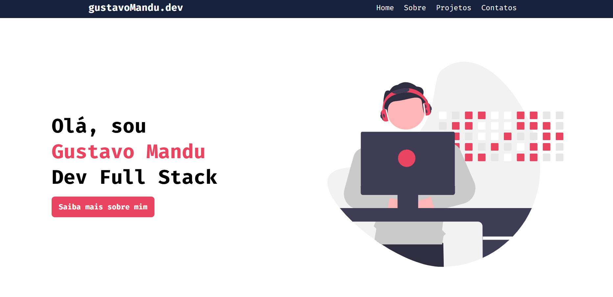
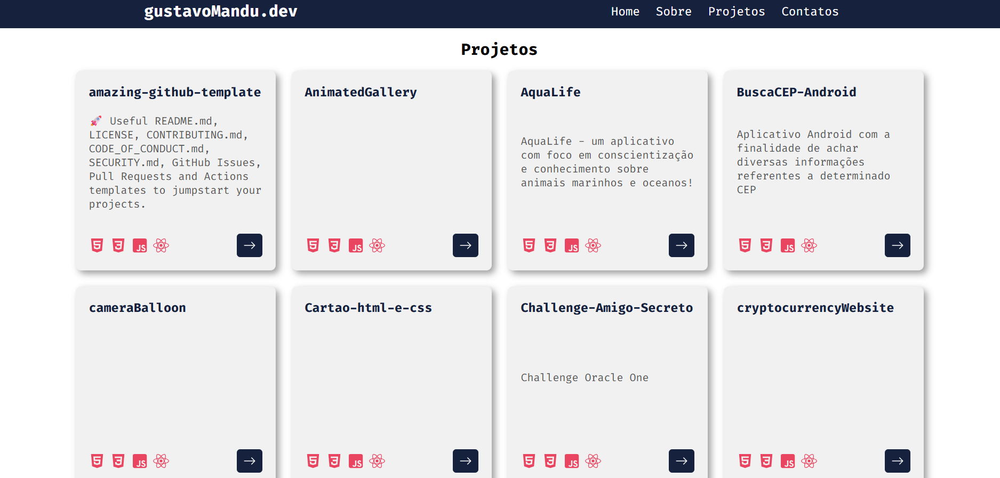

  <h1>📁 portfolio-ficticio</h1>

---

## 📖 Descrição

**portfolio-ficticio** é uma simples simulação de portfolio que tem como ponto principal fazer requisições para a API do GitHub, obtendo dados dos repositórios para exibição dinâmica.

---

## 🚀 Funcionalidades principais

- Busca e exibição de dados dos repositórios via API do GitHub  
- Textos informativos e conteúdo componentizado usando React  
- Navegação entre páginas com React Router  
- Interface simples

---

## 🛠️ Tecnologias utilizadas

  
  
  

---

## 🌐 Como acessar

O site está publicado com deploy automático via **GitHub Actions**.  
O link para acesso está disponível na descrição do repositório.

---

## 👨‍💻 Autor

- Gustavo Mandu Ferreira Matori

---

## 📷 Imagens

  

---

## 📄 Licença

Este projeto foi desenvolvido apenas para fins de treinamento e aprendizado.

---

## Créditos

Este projeto foi inspirado no tutorial do canal [Professor Edson Maia](https://www.youtube.com/@ProfessorEdsonMaia).
